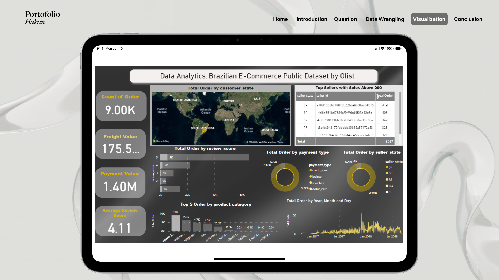

# Project Analisis Data E-Commerce

## Table of Content

[📌 Table of Content](#Table-of-Content)

[📤 Introduction](#Introduction)

[💭 Problem](#problem)

[📃 Data Wrangling](#Data_Wrangling)

[🖥️ Power BI Dashboard](#Power-BI-Dashboard)

[🏷️ Conclusion](#conclusion)

## 📤 Introduction

This project focuses on the analysis of a public dataset provided by Olist, a Brazilian e-commerce company. The dataset includes information about customer orders, products, payments, reviews, and more. The goal of this project is to extract meaningful insights from the data that can help improve business strategies and customer experience.

## 💭 Problem

- What are the top 10 product categories with the highest order volumes?

- What is the total number of orders received by sellers in each state?

- How many total orders are made using each payment type?

- Which sellers have over 200 sales?

- What is the average review score from customers?

## 📃 Data Wrangling

- Gathering Data
- Assesing Data
- Cleaning Data

## 🖥️ Power BI Dashboard

## 🏷️ Conclusion

- **Product Demand & Marketing**: Identifying the top 10 product categories by order volume helps businesses focus their marketing and sales efforts on the most in-demand products.
  
- **Top Sellers Analysis**: Analyzing the top sellers with over 200 sales provides valuable insights that can be used to improve the performance of other sellers.

- **Geographical Sales Distribution**: Understanding the distribution of total orders by seller state gives critical insights into regional sales trends, aiding in resource allocation and market targeting.

- **Customer Satisfaction**: Average review scores offer a gauge of customer satisfaction levels, which is essential for enhancing service quality.

- **Payment Preferences**: Insights into total orders by payment type inform decisions to improve customer convenience by prioritizing popular payment methods.
